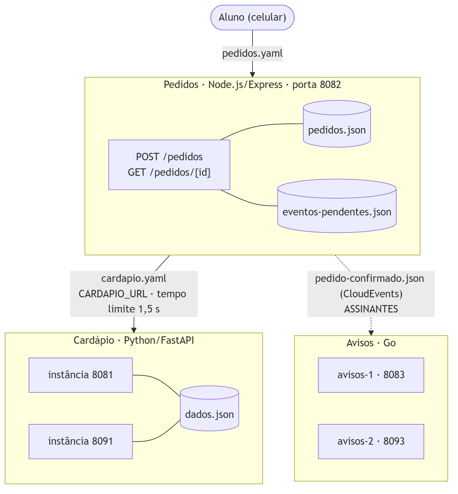
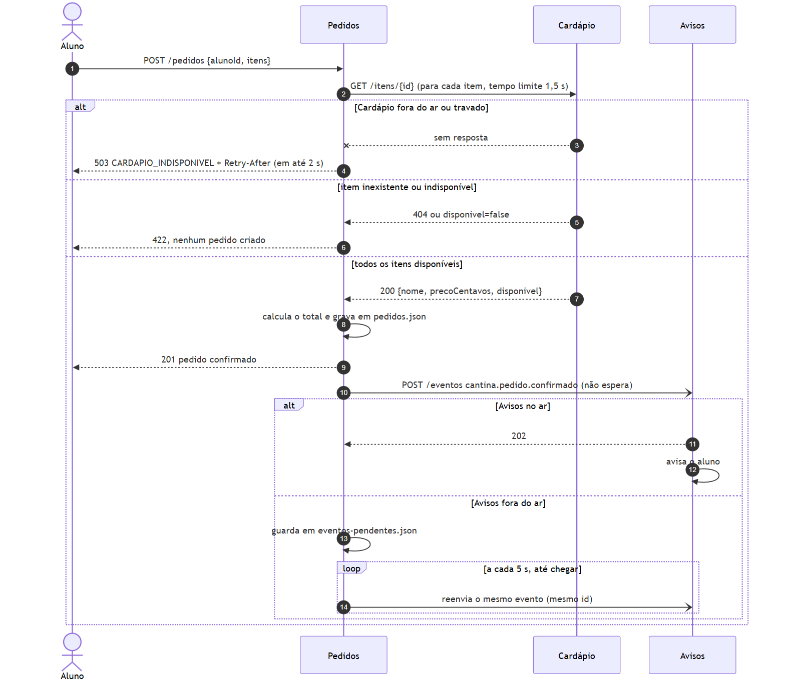

# SOA-Cantina

Sistema de pedidos da cantina do câmpus: o aluno pede pelo celular e é avisado quando o pedido é confirmado. São três serviços pequenos, ligados por contrato.

- **Cardápio**: informa o que há para vender.
- **Pedidos**: registra a compra consultando o Cardápio.
- **Avisos**: reage quando um pedido é confirmado.

## Grupo

| Integrante | RM |
|---|---|
| Arnaldo | 555780 |
| Carlos Eduardo | 99849 |
| Fabricio Carlos | 555017 |
| Leonardo Correia | 550413 |
| Vinicius Gardim | 556013 |

## Linguagens escolhidas

Cada serviço usa uma linguagem diferente. Quem garante que eles se entendam é o contrato em `contratos/`.

| Serviço | Linguagem | Framework |
|---|---|---|
| Cardápio | Python | FastAPI |
| Pedidos | JavaScript (Node.js) | Express |
| Avisos | Go | biblioteca padrão (`net/http`) |

## Ambiente

- GitHub Codespaces (recomendado) ou máquina local com a linguagem de cada serviço, Git e curl.
- Chamadas HTTP com `curl` (no PowerShell, use `curl.exe`).
- Desenho da arquitetura em Mermaid: o fonte (`.mmd`) e a imagem (`.png`) ficam em `arquitetura/`.

## Estrutura do repositório

```
├── contratos/       os contratos, antes do código
├── servicos/
│   ├── cardapio/
│   ├── pedidos/
│   └── avisos/
├── arquitetura/     fonte e imagem do desenho
├── evidencias/      saídas dos testes de cada missão
└── README.md        como rodar + matriz de princípios
```

## Contratos

| Arquivo | Serviço | Formato |
|---|---|---|
| [`contratos/cardapio.yaml`](contratos/cardapio.yaml) | Cardápio (portas 8081 e 8091) | OpenAPI 3.0 |
| [`contratos/pedidos.yaml`](contratos/pedidos.yaml) | Pedidos (porta 8082) | OpenAPI 3.0 |
| [`contratos/pedido-confirmado.json`](contratos/pedido-confirmado.json) | Evento `cantina.pedido.confirmado` | JSON Schema do envelope CloudEvents 1.0 |

Preços sempre em centavos (inteiros). Se o código e o contrato discordarem, o código está errado.

## Entregas

| Tag | Prazo | Entrega |
|---|---|---|
| `entrega-1` | seg 12/10 | O contrato primeiro: os três contratos, antes de qualquer código |
| `entrega-2` | seg 19/10 | Serviço autônomo: o Cardápio, com duas instâncias |
| `entrega-3` | seg 26/10 | Composição: o Pedidos, compondo o Cardápio |
| `entrega-4` | seg 2/11 | Evento: o Avisos e o canal de eventos |
| `entrega-5` | sex 6/11 | Entrega final: desenho final, README e matriz de princípios |

## Como rodar

### Os três serviços de uma vez (Codespaces ou Linux/macOS)

Pede Python 3.10+, Node.js 18+ e Go 1.22+. Rode a partir da raiz do repositório:

```bash
# Cardápio, duas instâncias
(cd servicos/cardapio && python -m venv .venv && .venv/bin/pip install -q -r requirements.txt)
(cd servicos/cardapio && PORTA=8081 .venv/bin/python app.py &)
(cd servicos/cardapio && PORTA=8091 .venv/bin/python app.py &)

# Avisos
(cd servicos/avisos && PORTA=8083 NOME=avisos-1 go run . &)

# Pedidos, compondo o Cardápio e publicando para o Avisos
(cd servicos/pedidos && npm install --silent)
(cd servicos/pedidos && PORTA=8082 CARDAPIO_URL=http://localhost:8081 \
   ASSINANTES=http://localhost:8083/eventos node server.js &)

# Um pedido de ponta a ponta
curl -X POST localhost:8082/pedidos -H "Content-Type: application/json" \
  -d '{"alunoId":"RM550413","itens":[{"itemId":1,"quantidade":2},{"itemId":2,"quantidade":1}]}'
curl localhost:8083/avisos
```

Para a demonstração, derrube o Avisos (`kill` no processo da porta 8083), faça outro pedido (o `201` continua) e suba o Avisos de novo. Em até 5 segundos o aviso chega.

| Serviço | Porta | Variáveis |
|---|---|---|
| Cardápio | 8081 e 8091 | `PORTA` |
| Pedidos | 8082 | `PORTA`, `CARDAPIO_URL`, `ASSINANTES` |
| Avisos | 8083 e 8093 | `PORTA`, `NOME` |

### Cardápio (Python 3.10+)

```bash
cd servicos/cardapio
python -m venv .venv
source .venv/bin/activate          # Windows: .venv\Scripts\activate
pip install -r requirements.txt
PORTA=8081 python app.py &         # instância 1
PORTA=8091 python app.py &         # instância 2
curl localhost:8081/itens
```

No PowerShell, a variável vai antes: `$env:PORTA=8081; python app.py`.

### Pedidos (Node.js 18+)

```bash
cd servicos/pedidos
npm install
PORTA=8082 CARDAPIO_URL=http://localhost:8081 node server.js &
curl -X POST localhost:8082/pedidos -H "Content-Type: application/json" \
  -d '{"alunoId":"RM550413","itens":[{"itemId":1,"quantidade":2},{"itemId":2,"quantidade":1}]}'
```

Os pedidos ficam em `servicos/pedidos/dados/pedidos.json`, que pertence só ao Pedidos e não vai para o Git.

Para publicar o evento de pedido confirmado, acrescente `ASSINANTES` com os endereços separados por vírgula:

```bash
PORTA=8082 CARDAPIO_URL=http://localhost:8081 \
ASSINANTES=http://localhost:8083/eventos node server.js &
```

### Avisos (Go 1.22+)

```bash
cd servicos/avisos
PORTA=8083 NOME=avisos-1 go run . &
curl localhost:8083/avisos          # avisos já enviados
```

Um segundo consumidor é só mais uma instância (`PORTA=8093 NOME=avisos-2 go run .`) e mais um endereço em `ASSINANTES`.

## Canal de eventos: Trilha A

O grupo escolheu a **Trilha A**: o Pedidos faz `POST` do evento, no envelope CloudEvents, em cada endereço de `ASSINANTES`.

**Por quê:** não pede nenhum servidor a mais, roda igual no Codespaces e no Windows, e o contrato do evento é o mesmo que seria publicado num broker. Passar para a Trilha B muda só o canal, não a mensagem.

**Como o pedido sobrevive à queda do Avisos:** o Pedidos responde `201` sem esperar o consumidor. Se a entrega falha, o evento fica em `dados/eventos-pendentes.json` e é reenviado a cada 5 segundos até chegar. O Avisos ignora eventos repetidos pelo `id`.

**O que a Trilha A não resolve:** o Pedidos ainda guarda a lista de assinantes (na configuração, não no código). Num broker, o consumidor assina sozinho e o Pedidos nem fica sabendo.

## Prova de fogo (Missão 3)

| Grupo | Linguagem do Cardápio deles | `CARDAPIO_URL` | Resultado |
|---|---|---|---|
| _a fazer na aula de 19/10_ | | | |

Antes da aula, o grupo trocou o `CARDAPIO_URL` para a segunda instância (8091), sem alterar o código, e o pedido saiu igual (teste 8 de `evidencias/missao3.txt`).

Pendente: a prova de fogo com outro grupo e o vídeo da demonstração são feitos pelo grupo, na aula e na data combinada.

## Arquitetura

### Visão de estrutura

Linha cheia é chamada HTTP síncrona. Linha tracejada é evento assíncrono. Cada serviço guarda os próprios dados, e nenhum lê o arquivo de outro. Fonte: [`arquitetura/estrutura.mmd`](arquitetura/estrutura.mmd).



### Visão de sequência de um pedido

O caminho feliz, o caminho de falha do Cardápio (`503` em até 2 s) e o caminho em que o Avisos está fora do ar (o pedido sai e o evento é reenviado). Fonte: [`arquitetura/sequencia.mmd`](arquitetura/sequencia.mmd).



### Decisões do grupo

| Decisão | Motivo |
|---|---|
| Três linguagens diferentes | Mostrar que é o contrato, e não a tecnologia, que faz os serviços se entenderem. |
| Preço em centavos inteiros | Evita erro de arredondamento entre Python, JavaScript e Go. |
| O pedido já nasce `confirmado` | A cantina não tem etapa de aprovação manual. O evento sai no mesmo momento. |
| O Pedidos copia o preço para o pedido | Se o Cardápio mudar o preço amanhã, o pedido de hoje não muda. |
| Tempo limite de 1,5 s no Cardápio | Cumpre o `503` em no máximo 2 s do contrato, com folga. |
| Trilha A, com reenvio | O pedido não depende do Avisos, e nenhum aviso se perde enquanto o Avisos está fora. |

## Matriz de princípios

| Princípio | Onde aparece no código do grupo |
|---|---|
| **Contrato padronizado** | Os três contratos em `contratos/` vieram antes do código (tag `entrega-1`). Cardápio e Pedidos em OpenAPI 3; o evento em JSON Schema sobre o envelope CloudEvents 1.0. Em `evidencias/missao4.txt`, o evento real é validado contra o contrato. |
| **Baixo acoplamento** | O Pedidos só conhece o Cardápio pelo endereço em `CARDAPIO_URL` ([`server.js:17`](servicos/pedidos/server.js#L17)) e pelo formato de `GET /itens/{id}`. Trocar de Cardápio é configuração (teste 8 de `missao3.txt`). Toda chamada tem tempo limite ([`server.js:119`](servicos/pedidos/server.js#L119)). |
| **Abstração** | Nenhum consumidor sabe que o Cardápio é Python, que os dados estão em `dados.json` ou que o Avisos é Go. O cabeçalho `X-Instancia` é detalhe interno e não está no contrato, então pode sumir sem quebrar ninguém. |
| **Reuso** | O Pedidos não guarda preço nem disponibilidade: usa o Cardápio ([`server.js:115`](servicos/pedidos/server.js#L115)). O mesmo Cardápio atenderia outro consumidor, como um totem ou um painel da cozinha, sem cópia da regra. |
| **Autonomia** | Cada serviço tem os próprios dados (`cardapio/dados.json`, `pedidos/dados/`) e a própria porta, lida de `PORTA` ([`app.py:15`](servicos/cardapio/app.py#L15), [`main.go:108`](servicos/avisos/main.go#L108)). Cada um sobe, cai e é implantado sozinho. |
| **Ausência de estado** | O Cardápio não guarda nada sobre quem chamou: duas instâncias respondem igual e uma segura a queda da outra (`missao2.txt`). O Pedidos guarda os pedidos em arquivo, não na memória do processo, e por isso continua de onde parou depois de reiniciar (`missao4.txt`, passo 4). |
| **Descoberta** | Quem lê `contratos/` usa o serviço sem abrir o código. Cada serviço expõe `GET /saude`. Os endereços vêm de configuração (`CARDAPIO_URL`, `ASSINANTES`), que é onde hoje entram DNS e registro de serviços. |
| **Composição** | O `POST /pedidos` combina o próprio registro com a consulta ao Cardápio, e o aviso ao aluno nasce da composição por evento: o Pedidos publica ([`server.js:176`](servicos/pedidos/server.js#L176)) e o Avisos reage, sem que um conheça o outro. |

## O que da SOA ficou de pé

Nenhuma missão usou WSDL, ESB ou UDDI, e os oito princípios aparecem no que o grupo construiu.

- **O WSDL virou OpenAPI e CloudEvents.** O contrato continua mandando: três linguagens conversam sem que nenhum serviço conheça o código do outro.
- **O ESB saiu do meio.** A composição foi para as pontas: o Pedidos chama o Cardápio direto, e o evento sai do próprio Pedidos.
- **O UDDI virou configuração e contrato versionado no repositório.**

O que ficou de pé foram as ideias: contrato, baixo acoplamento, autonomia e composição. As ferramentas da época saíram de cena.
